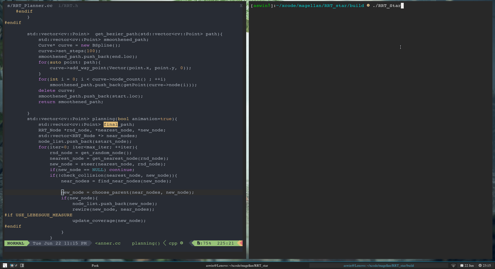

# RRT_star

This repository contains a C++ port of [RRT_Star from Python Robotics](https://pythonrobotics.readthedocs.io/en/latest/modules/path_planning.html), modified to meet our requirements. With the major differences being. 
- Use of cv:Mat to store MAP and display path
- Ability to load any MAP image and use it for path planning
- Usage of LineDrawing algorithm to check for obstacles. This helps us detect even obstacles which are a single grid cell thick, as opposed to the more common sampling based approaches. Also the line drawing algorithm uses ineteger arithmetic which beats the runtime when using floating point sampling with half grid resolution. The code uses integers wherever possible to reduce runtime.
- Using a more gradual roll of function for the neghbour hood distance 


  }{nnode})) vs )


- Ability to use lebesgue measure for Neighbour hood fall off with `USE_LEBESGUE MEASURE` option. It uses the following equations

  - ^\frac{1}{d}&space;(\mu(\chi_{free})/\xi)^\frac{1}{d}&space;)

  - /n)^\frac{1}{d},&space;\eta))
 
 where
 ```
  - d : dimension of space
  - u(xfree) : lebesgue measure 
  - eta : expand distance 
  - n : number of nodes formed till now
  ```
  
- Path smoothening with [spline library](https://github.com/chen0040/cpp-spline)
 

# RRT Star in Action


# RRT Star with smoothening on KITTI
Map is obtained by using ORB SLAM 2



# Building and running

``` bash
git clone https://github.com/SLAM-EE/RRT_star.git
mkdir spline/build
cd spline/build
cmake ..
make all
cd ../../
mkdir build 
cd build
cmake ..
make all
./RRT_Star
```

Alternatively run the build script given as 

```bash
git clone https://github.com/SLAM-EE/RRT_star.git
build.sh
```

## Requirements
- ### OpenCV 
    - opencv version 4 is used in this project
    - You might have to probably built it from sources 
    - A [build script](scripts/setup-opencv.sh) is provided in the scripts folder run the script as root. Verify the source download link if script fails.
    - Check installation using 
        ```bash
        sudo apt install pkg-config
        pkg-config --cflags opencv4
        ```
    - To use with OpenCV 3, modify [CMakeLists.txt](CMakeLists.txt) file line 29- 35 as below.
        ````cmake
        find_package(OpenCV 3 QUIET)
        if(NOT OpenCV_FOUND)
            find_package(OpenCV 2.4.3 QUIET)
            if(NOT OpenCV_FOUND)
                message(FATAL_ERROR "OpenCV > 2.4.3 not found.")
         endif()
        ```
     might have  change some code (mainly #defines used cv::IMREAD_COLOR) to make the code working with OpenCv 3
  

- #### cmake        
        
    
   
