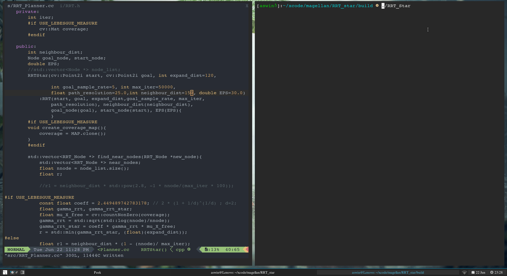

# RRT_star

This repository contains a C++ port of [RRT_Star from Python Robotics](https://pythonrobotics.readthedocs.io/en/latest/modules/path_planning.html), modified to meet our requirements. With the major differences being. 
- Use of cv:Mat to store MAP and display path
- Ability to load any MAP image and use it for path planning (right now it supports only square images)
- Usage of LineDrawing algorithm to check for obstacles. This helps us detect even obstacles which are a single grid cell thick, as opposed to the more common sampling based approaches. Also the line drawing algorithm uses ineteger arithmetic which beats the runtime when using floating point sampling with half grid resolution. The code uses integers wherever possible to reduce runtime.
- Using a more gradual roll of function for the neghbour hood distance 


  }{nnode})) vs )

# RRT Star in Action


# Building and running

``` 
git clone https://github.com/SLAM-EE/RRT_star.git
    mkdir build 
    cd build 
    cmake ..
    make all
    ./RRT_Star
```

## Requirements
- ### OpenCV 
    - opencv version 4 is used in this project
    - You might have to probably built it from sources 
    - A [build script](scripts/setup-opencv.sh) is provided in the scripts folder run the script as root. Verify the source download link if script fails.
    - Check installation using 
        ```
        sudo apt install pkg-config
        pkg-config --cflags opencv4
        ```
    - To use with OpenCV 3, modify [CMakeLists.txt](CMakeLists.txt) file line 29- 35 as below.
        ````
        find_package(OpenCV 3 QUIET)
        if(NOT OpenCV_FOUND)
            find_package(OpenCV 2.4.3 QUIET)
            if(NOT OpenCV_FOUND)
                message(FATAL_ERROR "OpenCV > 2.4.3 not found.")
         endif()
        ```
     might have  change some code (mainly #defines used cv::IMREAD_COLOR) to make the code working with OpenCv 3
  

- #### cmake        
        
    
   
